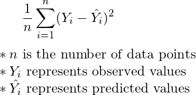
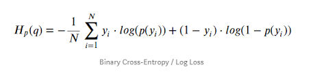

# devcGaboroneDeeplearningmeetup

[audience layout survay](https://www.surveymonkey.com/r/RRSTB89)
## Some Fundametals
- Types of neural networks
	1. Basic deep neural network
	2. CNN, DCNN 
	   * object classification
	   * object detection
	   
	3. GAN, DCGAN 
	   * Generate Photographs of Human Faces
	   * Photograph Editing
	   * Text-to-Image Translation (text2image)
	   * Image-to-Image Translation
	   
	4. AUTO ENCODERS
	* many more...
	
	
- Input output pipline
    What kind of data show the network expect and the expected output?
    eg 34x34 gray scale images -> class(probability) output
    
- data normalization
- batchnorm 2d, 1d, 3d 
	
- Training ( Forward and Backward propagation )

> How do i know if the model is training (learning something)

### Loss functions

Loss functions are used to determine the error (aka “the loss”) between the output of our algorithms and the given target value.  In layman’s terms, the loss function expresses how far off the mark our computed output is. 

* REGRESSION
  - Mean Square Error
    - 
  - Mean Absolute Error
    - 
* Classification
  - Log Loss, Negative Log Likelihood
    - 
  - CATEGORICAL CROSS ENTROPHY LOSS

- learning rate

- overfitting vs underfitting
	- [helpfull video](https://youtu.be/xj4PlXMsN-Y)
- momentum

### Activation functions [missinglink.ai](https://missinglink.ai/guides/neural-network-concepts/7-types-neural-network-activation-functions-right/)

> Activation functions are mathematical equations that determine the output of a neural network. The function is attached to each neuron in the network, and determines whether it should be activated (“fired”) or not, based on whether each neuron’s input is relevant for the model’s prediction. Activation functions also help normalize the output of each neuron to a range between 1 and 0 or between -1 and 1.

	* RELU
	* TanH
	* Sigmoid
	* Leaky ReLU
	* Softmax

	
## PRACTICAL

1.image classification
* segway into CNNs

(lab)[https://drive.google.com/file/d/1Af_QMevxdSgQM3jvawZ368KFWcwS1cNU/view?usp=sharing]

2. Sentiment analysis if we have time
* segway into DNN

